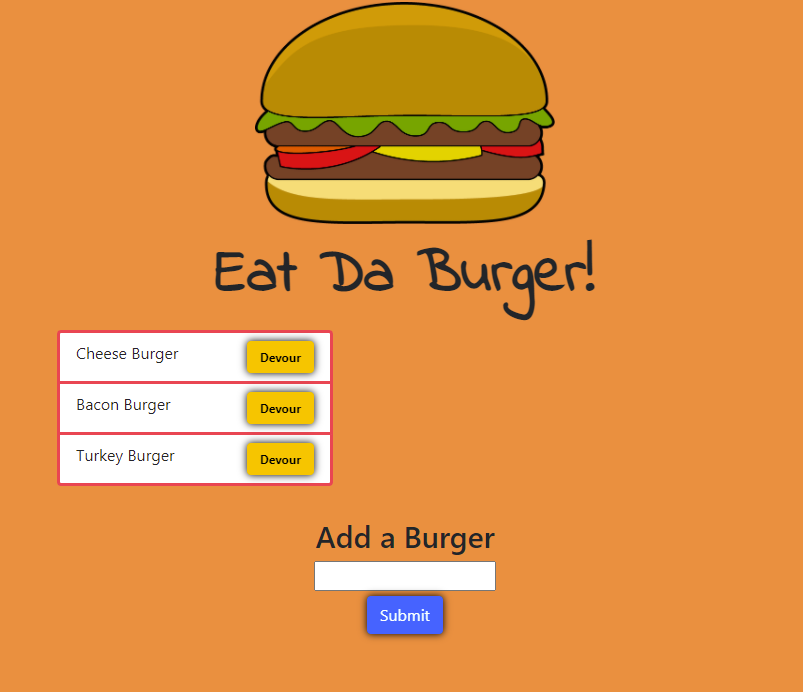
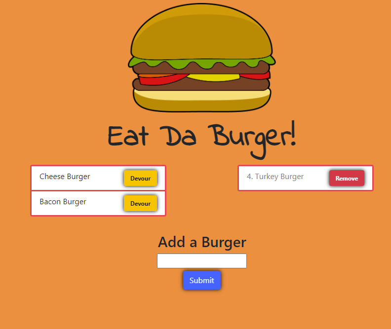

# Eat Da Burger!

## Description
    
This application is a bugger logger created with MySQL, Node, Express, Handlebars and a homemade ORM. 

## Table of Contents

* [Installation](#installation)
* [Usage](#usage)
* [Preview](#preview)
* [Deployed Application](#deployed-application)
* [Questions](#questions)

## Installation

#### Prerequisites

* [MySQL](https://dev.mysql.com/downloads/mysql/)
* [Node.js](https://nodejs.org/en/download/)

Download the project and run `npm i` in the directory to install the required npm packages.

Install the schema to mysql by using

`mysql> source db/schema.dql`

Edit the "connection.js" file in the config folder and update the password to yours

## Usage

Run `node index.js` to start the application and visit `http://localhost:8080` in browser to view it.

Type in the field below to add a burger, clicking the list of burgers on the left pane will devour it and move it to the devoured list on the right.

Clicking the delete butting on the right will remove the burger entirely from the DB.

Navigating to `http://localhost:8080/api/burgers` will return a JSON of all the burgers in the DB.

## Preview

## Deployed Application

A demo of this application is deployed live on Heroku

https://eat-da-burger768.herokuapp.com/

## Questions

If you have any questions, you can reach me through my github or email below

Github: [LinosM](https://github.com/LinosM)

Email: [NguyenDuy768@gmail.com](mailto:NguyenDuy768@gmail.com)